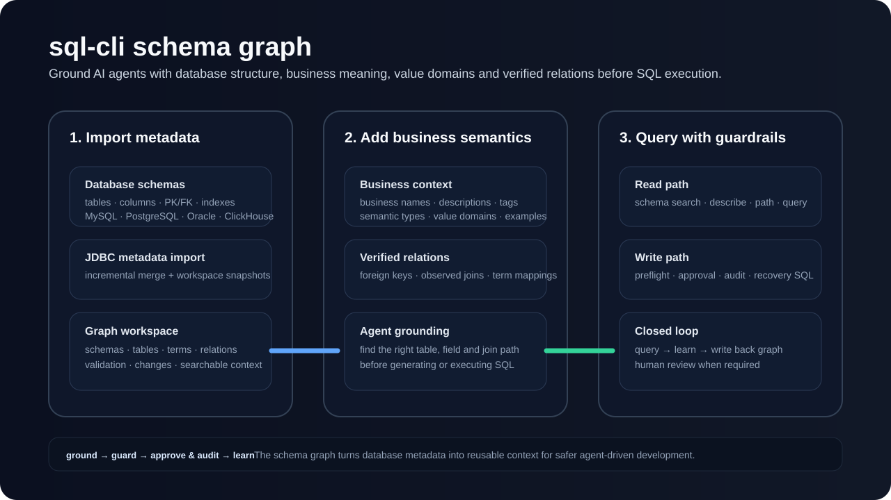

# sql-cli

**Database context and guarded SQL execution for AI coding agents.**

**English** | [简体中文](README.zh-CN.md)

[](https://github.com/sqlcli958/sqlcli/actions/workflows/ci.yml)

[](LICENSE)

`sql-cli` is more than an `execute_sql` command. It combines a **schema knowledge graph, business semantics, guarded SQL execution, human approval, audit history, and recovery SQL** so agents can work with real databases without guessing table names, column meaning, join paths, or enum values.


### Schema graph grounding



The graph turns raw database metadata into reusable agent context: schemas, tables, columns, business terms, value domains, verified relations, and reviewed candidate changes.

## Why sql-cli?

Most database tools for agents expose a query endpoint. sql-cli adds a governance loop around it:

1. **Ground** — inspect schema, columns, business terms, relationships, and value domains before writing SQL.
2. **Guard** — route SQL through one execution pipeline with read-only controls, single-statement boundaries, row limits, write preflight, and policy checks.
3. **Approve & audit** — optionally require human approval for risky writes and retain execution history plus recovery SQL.
4. **Learn** — write newly discovered business semantics and relationships back into the schema graph for future agent runs.

## Core capabilities

| Capability | What it provides |
|---|---|
| Multi-database access | JDBC-based access for MySQL, PostgreSQL, Oracle, and ClickHouse |
| Agent grounding | Schema search, table/column descriptions, relationship paths, business terms, and value domains |
| Safe SQL execution | Read-only controls, preflight/approval, row limits, timeout handling, and audit records |
| Schema knowledge graph | Metadata, business names, terms, relationships, candidate changes, and schema policies |
| Recovery | Recovery SQL for supported UPDATE / DELETE operations plus execution history |
| Web UI | Workspace, graph, policy, review, and settings views |
| Sensitive data handling | Secure secret storage and SM4 column encryption/decryption |
| Automation-friendly output | CSV, JSON, ASCII tables, and explicit process exit codes |

## Quick start

Requirements: **Java 17+**. A full package build also requires Node.js because the Web UI is bundled into the executable JAR.

```bash
mvn clean package
java -jar target/sql-cli.jar --help
```

Optional local installation:

```bash
sh sh/install.sh
sql-cli --help
```

Next steps:

- [5-minute getting started guide](docs/getting-started.md)
- [Chinese user manual](docs/user-manual.zh-CN.md)
- [Documentation index](docs/README.md)

## Agent integration

The repository ships an [`sql-cli` Skill](skills/sql-cli/SKILL.md) for coding agents. It instructs the agent to ground database work in the schema graph before executing real queries, and to respect approval, safe-execution, and graph-writeback rules.

## Supported databases

- MySQL
- PostgreSQL
- Oracle
- ClickHouse

Database JDBC drivers and third-party dependencies remain subject to their own licenses.

## Contributing

Bug reports, feature proposals, and pull requests are welcome. See [CONTRIBUTING.md](CONTRIBUTING.md) before contributing. For security issues, see [SECURITY.md](SECURITY.md).

## License

[Apache License 2.0](LICENSE)
