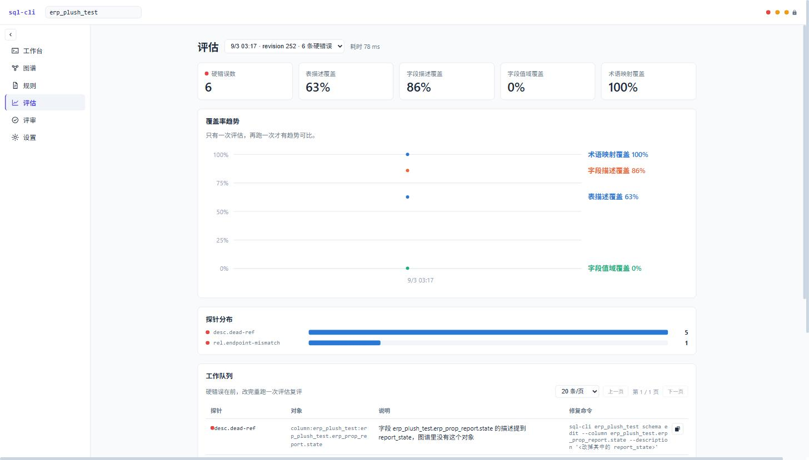

# sql-cli

**为 AI Coding Agent 提供数据库语义上下文与安全 SQL 执行能力。**

[English](README.md) | **简体中文**

[](https://github.com/sqlcli958/sqlcli/actions/workflows/ci.yml)

[](LICENSE)

`sql-cli` 不只是一个执行 SQL 的命令行工具。它把 **Schema 知识图谱、业务语义、SQL 安全执行、人工审批、审计与恢复** 放进同一个工作流，让 Agent 在接触真实数据库时尽量少猜表名、字段含义、JOIN 条件和值域。



## 为什么是 sql-cli

典型数据库 Agent 往往只有一个 `execute_sql` 工具，而 sql-cli 把数据库操作拆成一个可治理闭环：

1. **Ground** — 查询前先用 Schema 图谱确认表、列、业务术语、关系和值域。
2. **Guard** — 所有 SQL 进入统一执行管线，应用只读限制、单语句边界、行数上限、写操作预检与规则检查。
3. **Approve & Audit** — 高风险写操作可进入人工审批，并保留执行记录与恢复 SQL。
4. **Learn** — Agent 在代码和数据库中发现的新语义可以写回图谱，形成持续积累的上下文。

## 核心能力

| 能力 | 说明 |
|---|---|
| 多数据库访问 | 基于 JDBC，支持 MySQL、Oracle、PostgreSQL、ClickHouse |
| Agent 语义上下文 | Schema 搜索、表/列描述、关系路径、业务术语和值域 |
| SQL 安全执行 | 只读限制、写操作预检/审批、行数限制、超时、审计 |
| Schema 知识图谱 | 管理元数据、业务名称、术语、关系、候选变更与结构规则 |
| 数据恢复 | UPDATE / DELETE 执行前生成恢复 SQL，并保留执行记录 |
| Web UI | 工作台、图谱、规则、评审、设置 |
| 敏感数据处理 | 密码安全存储与 SM4 列级加密/解密 |
| Agent / 脚本友好 | CSV、JSON、ASCII Table 输出与明确退出码 |

## 快速开始

环境要求：**Java 17+**；完整打包还需要 Node.js（Web UI 会一起构建）。

```bash
mvn clean package
java -jar target/sql-cli.jar --help
```

安装到本机：

```bash
sh sh/install.sh
sql-cli --help
```

更多内容：

- [5 分钟快速开始](docs/getting-started.zh-CN.md)
- [完整使用手册](docs/user-manual.zh-CN.md)
- [文档导航](docs/README.md)

## Agent 集成

仓库提供 [`sql-cli` Skill](skills/sql-cli/SKILL.md)。它要求 Agent 在执行真实查询前优先通过 Schema 图谱确认结构和语义，并遵守审批、安全执行和图谱写回约束。

## 支持的数据库

- MySQL
- PostgreSQL
- Oracle
- ClickHouse

数据库 JDBC 驱动与第三方依赖分别遵循其自身许可证。

## 参与贡献

欢迎提交 Bug、功能建议和 Pull Request。开始前请阅读 [CONTRIBUTING.md](CONTRIBUTING.md)。安全问题请阅读 [SECURITY.md](SECURITY.md)。

## 开源协议

[Apache License 2.0](LICENSE)
